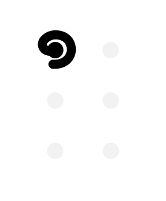

## Gestures
 - [circle](#circle)
 - [half circle](#half-circle)
 - [bean](#bean)
 - [dash](#dash)
 - [line](#line)
 - [column](#column)
 - [diagonal](#diagonal)

### Circle
The Circle always has direction - it could be clockwise(CW) or counterclockwise(CCW).
The Circle can repeat itself (besides single circle there could double and triple circles).

The combination of direction and repeating allows to define those Braille symbols:
 - Dot CCW 1 - `⠁`
 - Dot CCW 2 - `⠂`
 - Dot CCW 3 - `⠄`
 - Dot CW 1 - `⠈`
 - Dot CW 2 - `⠐`
 - Dot CW 3 - `⠠`

###  Half Circle
The Half Circle always has direction - it could be ClockWise(CW) or CounterClockWise(CCW).

Braille symbols:
 - Half Circle CW - `⠅`
 - Half Circle CCW - `⠨`

### Bean
Bean is a more complex gesture - it contains when there are only 2 dots that dont share any columns, and they dont have any neighbors:

Braille symbols:
 - Bean RT/LB - `⠌`
 - Bean LT/RB - `⠡`

### Dash
Dash is a horizontal line with the length of 2 dots;
Dash can repeat itself (besides single dash there could double and triple dashes)

The combination of direction and repeating allows to define those Braille symbols:
 - Dash 1 - `⠉`
 - Dash 2 - `⠒`
 - Dash 3 - `⠤`

### Line
Line is a vertical line with the length of 2 dots;

### Column
Column is a vertical line with the length of 3 dots;

### Diagonal
Diagonal is two dots placed in different columns, that share 2 empty cells-neighbors.
Diagonal always starts from the corner.
Diagonal has a startpoint - (RightTop/RightBottom/LeftTop/LeftBottom)

The combination of direction and startpoint allows to define those Braille symbols:
 - Diagonal RightTop - `⠊`
 - Diagonal LeftBottom - `⠔`
 - Diagonal LeftTop - `⠑`
 - Diagonal RightBottom - `⠢`

## Combinations:

### Circle + Line:
 - Line RightTop - `⠃`
 - Line RightBottom - `⠆`
 - Line LeftTop - `⠘`
 - Line LeftBottom - `⠰`

### Circle + Column:
 - Column Right - `⠇`
 - Column Left - `⠸`

### Dash + Line:
 - Corner LT - `⠋`
 - Corner MT - `⠓`
 - Corner MB - `⠖`
 - Corner TR - `⠙`
 - Corner BL - `⠦`
 - Corner MB - `⠲`
 - Corner MR - `⠚`
 - Corner BR - `⠴`

### Dash + Line + Dash:
 - Box Top - `⠛`
 - Box Bottom - `⠶`

### Column + Diagonal
 - Shoulder Left - `⠺`
 - Shoulder Right - `⠗`

### Diagonal + Diagonal
 - Arrow Left - `⠪`
 - Arrow Right - `⠕`

### Diagonal + Diagonal + Dash
 - Shoulder Left - `⠺`
 - Shoulder Right - `⠗`

### Line + Diagonal
 - Cross LeftLeftRight - `⠣`
 - Cross RightLeftLeft - `⠎`
 - Cross RightRightLeft - `⠜`
 - Cross LeftRightRight - `⠱`

### Line + Dash + Line
 - Snake RT/LB - `⠞`
 - Snake LT/RB - `⠳`

### Dash + Column
 - Knight RightTop - `⠏`
 - Knight RightBottom - `⠧`
 - Knight LeftTop - `⠹`
 - Knight LeftBottom - `⠼`

### Dash + Line + Diagonal
 - Hook LeftTop - `⠝`
 - Hook RightTop - `⠫`
 - Hook RightBottom - `⠮`
 - Hook LeftBottom - `⠵`

### Dash + Column + Dash
 - Bracket Right - `⠯`
 - Bracket Left - `⠽`

### Dash + Half Circle
 - Wall LeftBottom - `⠍`
 - Wall LeftTop - `⠥`
 - Wall RightBottom - `⠩`
 - Wall RightTop - `⠬`

### Dash + Half Circle + Dash
 - Stripe - `⠭`

### Line + Dash + Line + Dash
 - Cut RightBottom - `⠟`
 - Cut RightTop - `⠷`
 - Cut LeftBottom - `⠻`
 - Cut LeftTop - `⠾`

### Column + Dash + Column
### Dash + Line + Dash + Line + Dash
 - Full - `⠿`
